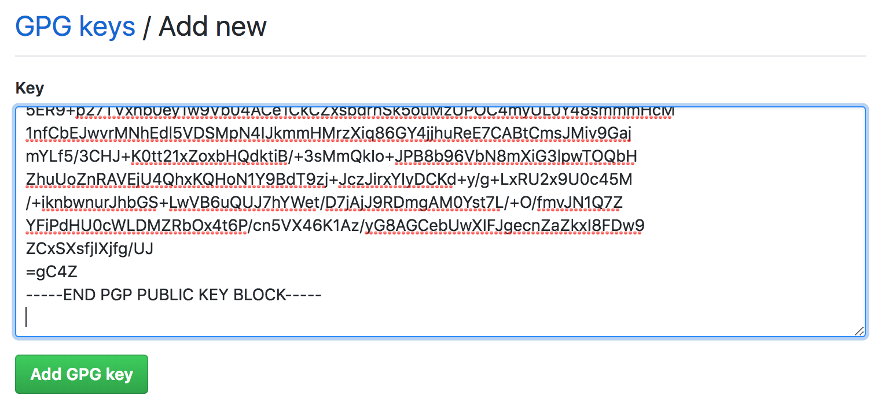
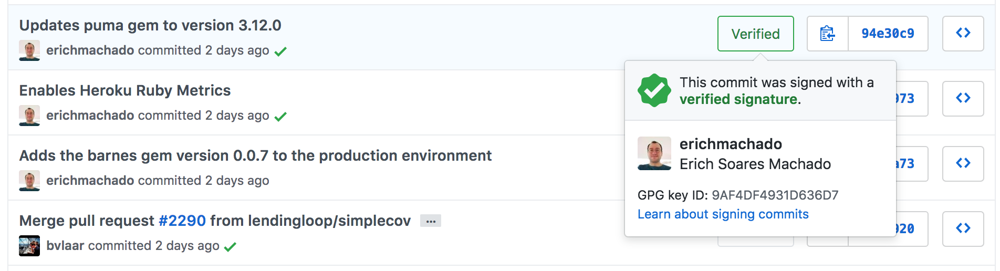

---
# GPG

---
## macOS Setup

```console
$ brew install gnupg
```
---
## Generating the GPG Key

```console
$ gpg --full-generate-key
```

+++
### Fill the required information

```console
Please select what kind of key you want:
   (1) RSA and RSA (default)
   (2) DSA and Elgamal
   (3) DSA (sign only)
   (4) RSA (sign only)
Your selection? 1
RSA keys may be between 1024 and 4096 bits long.
What keysize do you want? (2048) 4096
Requested keysize is 4096 bits
Please specify how long the key should be valid.
         0 = key does not expire
      <n>  = key expires in n days
      <n>w = key expires in n weeks
      <n>m = key expires in n months
      <n>y = key expires in n years
Key is valid for? (0) 1
Key expires at Sun Sep 23 17:54:18 2018 EDT
Is this correct? (y/N) y

GnuPG needs to construct a user ID to identify your key.

Real name: John Doe
Email address: john.doe@example.com
Comment: 1st user key
You selected this USER-ID:
    "John Doe (1st user key) <john.doe@example.com>"

Change (N)ame, (C)omment, (E)mail or (O)kay/(Q)uit? O
```

@[6](The recommended is RSA and RSA)
@[8](The recommended is 4096 bits)
@[16-18](Set the key expiration)
@[22](Type your name)
@[23](Type your email)
@[24](Optionally set a comment)
@[28](Confirm)

---
## Add a new signing sub-key

```console
$ gpg --edit-key john.doe@example.com
```

+++
### Type the command to add a new key

```console
gpg> addkey
```

+++
### Configure the new key

```console
Please select what kind of key you want:
   (3) DSA (sign only)
   (4) RSA (sign only)
   (5) Elgamal (encrypt only)
   (6) RSA (encrypt only)
Your selection? 4
RSA keys may be between 1024 and 4096 bits long.
What keysize do you want? (2048) 4096
Requested keysize is 4096 bits       
Please specify how long the key should be valid.
         0 = key does not expire
      <n>  = key expires in n days
      <n>w = key expires in n weeks
      <n>m = key expires in n months
      <n>y = key expires in n years
Key is valid for? (0) 1
Key expires at Mon Sep 24 11:58:08 2018 EDT
Is this correct? (y/N) y
Really create? (y/N) y  
We need to generate a lot of random bytes. It is a good idea to perform
some other action (type on the keyboard, move the mouse, utilize the
disks) during the prime generation; this gives the random number
generator a better chance to gain enough entropy.

sec  rsa4096/EDB19D6F8FEB1C4A
     created: 2018-09-22  expires: 2018-09-23  usage: SC  
     trust: ultimate      validity: ultimate
ssb  rsa4096/72F135207D928E1D
     created: 2018-09-22  expires: 2018-09-23  usage: E   
ssb  rsa4096/DC1AA88B396101F5
     created: 2018-09-23  expires: 2018-09-24  usage: S   
[ultimate] (1). John Doe (1st user key) <john.doe@example.com>
```

@[6](Select the type of key)
@[8](Select the key size)
@[16](Select the key expiration)
@[18-19](Confirm)
@[25-32](Check the results)

---
## Backup

+++
### Exporting the secret keys and the ownertrust values

```console
$ gpg --output jd-secret-gpg.key --armor --export-secret-keys john.doe@example.com
$ gpg --export-ownertrust > jd-trust-gpg.txt
```

@[1](Exports an ASCII armored version of the secret keys, including the public keys)
@[2](Exports the ownertrust values stored in the trustdb)

+++
### Restoring the backup

```console
$ gpg --import jd-secret-gpg.key
$ gpg --import-ownertrust jd-trust-gpg.txt
```

+++
### Exporting the public keys only

```console
$ gpg --output jd-public-gpg.key --armor --export john.doe@example.com
```

---
### Removing the master private key

+++
### Find the master key keygrip

```console
$ gpg --list-secret-keys --with-keygrip
sec   rsa4096 2018-09-22 [SC]
      E381566229F5E37597C7F454EDB19D6F8FEB1C4A
      Keygrip = A3EF6AFBE9F31676FEFEC38B91674A5E105EC7AD
uid           [ultimate] John Doe (1st user key) <john.doe@example.com>
ssb   rsa4096 2018-09-22 [E] [expires: 2019-09-24]
      Keygrip = 724493363EB41E77924439CEACB033690C429DE1
ssb   rsa4096 2018-09-23 [S] [expires: 2019-09-24]
      Keygrip = 5F48BB1BE4BCD91F1378DE992256AC00A199F243
```

+++
### Remove the master private key file

```console
$ rm $HOME/.gnupg/private-keys-v1.d/A3EF6AFBE9F31676FEFEC38B91674A5E105EC7AD.key
```

+++
### Check that the master private key was removed

```console
$ gpg -K
sec#  rsa4096 2018-09-22 [SC]
      E381566229F5E37597C7F454EDB19D6F8FEB1C4A
uid           [ultimate] John Doe (1st user key) <john.doe@example.com>
ssb   rsa4096 2018-09-22 [E] [expires: 2019-09-24]
ssb   rsa4096 2018-09-23 [S] [expires: 2019-09-24]
```
@[2](The # character indicates that this key is not available anymore)

---
## Signing Git commits

+++
### Fetching the signing subkey ID

```console
$ gpg --list-secret-keys --keyid-format LONG john.doe@example.com
sec   rsa4096/EDB19D6F8FEB1C4A 2018-09-22 [SC] [expires: 2018-09-23]
      E381566229F5E37597C7F454EDB19D6F8FEB1C4A
uid                 [ultimate] John Doe (1st user key) <john.doe@example.com>
ssb   rsa4096/72F135207D928E1D 2018-09-22 [E] [expires: 2018-09-23]
ssb   rsa4096/DC1AA88B396101F5 2018-09-23 [S] [expires: 2018-09-24]
```

@[6](Copy the signing subkey ID)

+++
### Configuring your signing key on Git

```console
$ git config user.signingkey DC1AA88B396101F5
```

Or globally

```console
$ git config --global user.signingkey DC1AA88B396101F5
```

+++
### Signing your first commit

```console
$ git commit -S -am "My first signed commit"
```

+++
### Pin-entry on Mac

```console
$ brew install pinentry-mac
$ echo "pinentry-program /usr/local/bin/pinentry-mac" >> $HOME/.gnupg/gpg-agent.conf
$ gpgconf --kill gpg-agent
```

@[1](Install the pinentry software for Mac)
@[2](Set the GPG agent to use the pinentry software for passphrase prompt)
@[3](Restart the GPG agent)

+++
### Displaying the commit signature

```console
$ git log --show-signature -1
commit 3ef50e8107f618fb1fa20ed638ae60905bccb753 (HEAD -> master)
gpg: Signature made Sun Sep 23 13:56:36 2018 EDT
gpg:                using RSA key 3BAD4357FBFC736A7B84BB28DC1AA88B396101F5
gpg: Good signature from "John Doe (1st user key) <john.doe@example.com>" [ultimate]
Author: John Doe <john.doe@example.com>
Date:   Sun Sep 23 13:56:35 2018 -0400

    My first signed commit
```

+++
### Verifying the commit signature

```console
$ git verify-commit 3ef50e8107f618fb1fa20ed638ae60905bccb753
gpg: Signature made Sun Sep 23 13:56:36 2018 EDT
gpg:                using RSA key 3BAD4357FBFC736A7B84BB28DC1AA88B396101F5
gpg: Good signature from "John Doe (1st user key) <john.doe@example.com>" [ultimate]
```

+++
### Enabling commit signature by default

```console
$ git config commit.gpgsign true
```

Or globally

```console
$ git config --global commit.gpgsign true
```

---
## Commit signature verification on GitHub

+++
### Export the public signing subkey

```console
$ gpg --armor --export DC1AA88B396101F5! | pbcopy
```

@[1](The same ID you used to set Git, don't forget to add the bang)

+++
### Paste it to the GitHub GPG dashboard



+++
### Check the configured key


+++
### Now your commits will be verified by GitHub



---
## Congratulations!


---
### References

@ul

- https://help.github.com/articles/generating-a-new-gpg-key/
- https://help.github.com/articles/telling-git-about-your-signing-key/
- https://blog.tinned-software.net/create-gnupg-key-with-sub-keys-to-sign-encrypt-authenticate/
- https://www.paulfurley.com/gpg-for-humans-protecting-your-primary-key/
- https://alexcabal.com/creating-the-perfect-gpg-keypair/
- https://gist.github.com/chrisroos/1205934
- https://lists.gnupg.org/pipermail/gnupg-users/2017-January/057400.html

@ulend
